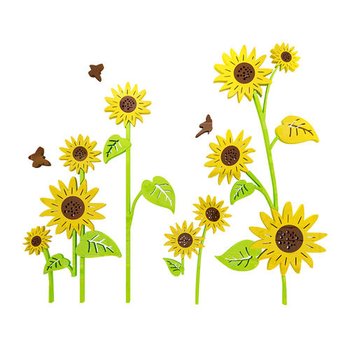

# 一.WEB项目---分工说明

[TOC]


## 1.1小组分工

### 1.1.1组员

- **令狐荣豪**

## 1.2分工明细

### 1.2.1步骤

- 1.可以使用墨刀工具修原型图主界面
- 2.数理网站目录结构	
- 3.设计每个页面排版样式，模块布局	
- 4.准备素材图/也可从参考网站进行搬运	
- 5.计算所需图片尺寸，配合网站设计所需进行增图，删图，改图。	
- 6.代码实现	
- 7.测试
- 8.完成实验报告

### 1.2.2原型图设计明细

- 找图/切图/构图/画图布局
- 颜色调节/暗度

### 1.2.3网站目录结构整理

- 首页设计
- 登录页设计
- 留言页面设计
- 系内介绍子页面设计
- 学校事迹页面设计

### 1.2.3素材准备整理/素材所需工具/代码参考

- 图片类image
- 图片类images
- PS/word文档
- 阿里云ICON网站
- 菜鸟网教程
- W3School教程参考

# 二.代码实现

## 2.1项目所用技术栈

- ### HTML5+CSS3+JavaScript+Jquery

## 2.2项目结构组成

|                                                              |                                                              |
| ------------------------------------------------------------ | ------------------------------------------------------------ |
|  |  |


```properties
-assets
	-css
	-img
	-js
		-html.js
		-script.js
		-.......

-image

-images

-js
	-jquery-1.4.2.min.js

-script
	-fun.js.js
	-jquery-1.7.1.min.js
	-js.js

-style

-index.html

-introduce.html

-liuyan.html

-Login.html

-SchoolEvent.html
```

## 2.2代码实现贴图

### 2.2.3`index`首页代码展示：

```html
<!DOCTYPE html
  PUBLIC "-//W3C//DTD XHTML 1.0 Transitional//EN" "http://www.w3.org/TR/xhtml1/DTD/xhtml1-transitional.dtd">
<html xmlns="http://www.w3.org/1999/xhtml">

<head>
  <meta charset="UTF-8">
  <meta name="viewport" content="initial-scale=1.0, user-scalable=no" />

  <title>计科系网</title>
  <meta name="Keywords" content="" />
  <meta name="Description" content="" />
  <link href="style/style.css" rel="stylesheet" type="text/css" />
  <link href="style/slick.css" rel="stylesheet">
  <link href="style/index_20200513.css" rel="stylesheet" type="text/css">
  <link href="style/news_index_416.css" rel="stylesheet" type="text/css">
  <script language="javascript" type="text/javascript" src="script/jquery-1.7.1.min.js"></script>
  <script type="text/javascript" src="js/jquery-1.4.2.min.js"></script>
  <script language="javascript" type="text/javascript" src="script/js.js"></script>
  <script language="javascript" type="text/javascript" src="script/fun.js"></script>


  <!--[if lte IE 6]>
<script src="script/png.js" type="text/javascript"></script>
    <script type="text/javascript">
        DD_belatedPNG.fix('div, ul, img, li, input , a');
    </script>
<![endif]-->
  <script type="javascript">

</script>
</head>

<body onload="init()">
  <div class="div-a">
    <div class="headDiv">
      <div class="w968">
        <!--Logo设计-->
        &nbsp;&nbsp;&nbsp;&nbsp;&nbsp;&nbsp;
        

        <div class="topSearch">
          <form name="formsearch" action="./?search" method="post">
            <input type="text" name="key" class="input1" />
            <input type="submit" class="btn1" value="" />
          </form>
        </div>
        <div class="topLanguage">
          <a href="/?en.html">致力推广计科文化</a><br /><a href="/"></a>
        </div>
        <div class="nav">
          <ul>
            <li><a href="index.html" class="sN">首页</a></li>
            <li><a href="introduce.html" class="sNavA">系部概况</a></li>
            <li><a href="fanyibu.html" class="sNavA">通知公告</a></li>
            <li><a href="fanyianli.html" class="sNavA">系内动态</a></li>
            <li><a href="jinqixiangmu.html" class="sNavA">党团建设</a></li>
            <li><a href="rencaizhaoping.html">教学研究</a></li>
            <li><a href="lianxiwomen.html">专业设置</a></li>
            <li><a href="xinxifankui.html">中日课程合作</a></li>
            <li><a href="xinxifankui.html">教师风采</a></li>
            <li><a href="xinxifankui.html">学生工作</a></li>
            <li><a href="xinxifankui.html">精品课程</a></li>
          </ul>
        </div>
      </div>
    </div>


    <div class="sNav">
      <ul>
        <li><a href="gaikuang.html">系部简介</a></li>
        <li><a href="lingdaotuanti.html">内设机构</a></li>
        <li><a href="gongsijigou.html">系内事迹</a></li>
        <li><a href="gongsishiji.html">公司事迹</a></li>

      </ul>
    </div>
    <div class="sNav">
      <ul>
        <li><a href="fanyibu.html">校内通知</a></li>
        <li><a href="gongguanbu.html">系内通知</a></li>

      </ul>
    </div>

    <div class="sNav">
      <ul>
        <li><a href="shangxi.html">学生</a></li>
        <li><a href="cuowufenxi.html">教师</a></li>
      </ul>
    </div>

    <div class="sNav">
      <ul>
        <li><a href="jinqixiangmu.html">近期项目</a></li>
        <li><a href="hezuowangzhan.html">合作网站</a></li>
        <li><a href="jingqumenpiao.html">景区门票</a></li>
      </ul>
    </div>

    <div class="sNav">
      <ul>
        <li><a href="/?photo/tp/251.html">#</a></li>
        <li><a href="/?audio/tp/252.html">#</a></li>
      </ul>
    </div>

    <div class="sNav">
      <ul>
        <li><a href="/?djyd/tp/253.html">#</a></li>
        <li><a href="/?djyd/tp/254.html">#</a></li>
        <li><a href="/?djyd/tp/255.html" title="">#</a></li>
        <li><a href="/?djyd/tp/256.html" title="">#</a></li>
        <li><a href="/?down/tp/257.html">#</a></li>
      </ul>
    </div>

    <div class="sNav">
      <ul>
        <li><a href="/?contact/tp/258.html">#</a></li>
        <li><a href="/?map1/tp/259.html">#</a></li>
        <li><a href="/?map2/tp/260.html">#</a></li>
      </ul>
    </div>
    <div class="wal">
      <div class="pageBg">
        <div class="w968">


          <div class="all" id='all'>
            <div class="screen" id="screen">
              <ul id="ul">
                <li></li>
                <li></li>
                <li></li>
                <li></li>
                <li></li>
              </ul>
              <ol>

              </ol>
              <div id="arr">
                <span id="left">
                  </span>
                    <span id="right">></span>
              </div>
            </div>
          </div>


          <!--w968-->

          <div id="content">
            <div class="container">
              <div class="notice">
                <div>
                  <a href="/jkx/class.aspx?id=117&cid=6"></a>
                </div>
                <div id="_userlogin">

                  <marquee direction="up" scrollamount="1" height="128" width="200">


                    <li><a href="/jkx/content.aspx?ChannelId=6&id=7412" title="关于2019年端午节放假教学安排的通知"
                        style="color:">关于2019年端午节放假教学安排的通</a>&nbsp;<span>05-30</span></li>

                    <li><a href="/jkx/content.aspx?ChannelId=6&id=7283" title="关于组织收看 《春天的课堂—第八届首都十大教育新闻人物公开课》的通知 "
                        style="color:">关于组织收看 《春天的课堂—第八届</a>&nbsp;<span>04-12</span></li>

                    <li><a href="/jkx/content.aspx?ChannelId=6&id=7282" title="关于2019年“五•一”劳动节放假教学安排的通知"
                        style="color:">关于2019年“五•一”劳动节放假教</a>&nbsp;<span>04-12</span></li>

                    <li><a href="/jkx/content.aspx?ChannelId=6&id=7281" title="关于世园会压力测试期间教学活动安排的通知 "
                        style="color:">关于世园会压力测试期间教学活动安</a>&nbsp;<span>04-12</span></li>

                    <li><a href="/jkx/content.aspx?ChannelId=6&id=6790" title="“中秋节”、“国庆节”假期安全提示 "
                        style="color:">“中秋节”、“国庆节”假期安全提</a>&nbsp;<span>09-21</span></li>

                    <li><a href="/jkx/content.aspx?ChannelId=6&id=6789" title="关于2018年中秋节、国庆节放假教学安排的通知"
                        style="color:">关于2018年中秋节、国庆节放假教学</a>&nbsp;<span>09-21</span></li>

                    <li><a href="/jkx/content.aspx?ChannelId=6&id=6625" title="关于2018-2019学年第一学期开学初补考安排的通知"
                        style="color:">关于2018-2019学年第一学期开学初补</a>&nbsp;<span>07-13</span></li>

                    <li><a href="/jkx/news/article-6-4644.aspx" title="图书馆关于启用门禁系统的通知"
                        style="color:">图书馆关于启用门禁系统的通知</a>&nbsp;<span>05-04</span></li>


                  </marquee>


                </div>
              </div>
              <div id="line">
                
              </div>
              <div class="notice">
                <div>
                  
                </div>


                <div class="ext3">教学研究</div>
                <div class="ext">
                  <a style="color:#000" <href="/jkx/class.aspx?id=120&cid=6"></a>
                </div>
                <div>
                  
                </div>
                <div class="ext2">
                  <ul>


                    <li><a href="/jkx/content.aspx?ChannelId=6&id=7411" title=" 我院全国计算机等级考试成绩大幅提高，4个班级100%通过"
                        style="color:"> 我院全国计算机等级考试成绩大幅提</a>&nbsp;<span>05-30</span></li>

                    <li><a href="/jkx/content.aspx?ChannelId=6&id=7376" title="计算机系2019届毕业设计（论文）答辩顺利完成"
                        style="color:">计算机系2019届毕业设计（论文）答</a>&nbsp;<span>05-21</span></li>

                    <li><a href="/jkx/content.aspx?ChannelId=6&id=6741" title="我系教师参加“第二届教育部在线教育研究中心智慧教学研讨会暨2018雨课堂峰会” "
                        style="color:">我系教师参加“第二届教育部在线教</a>&nbsp;<span>09-15</span></li>


                  </ul>
                </div>
              </div>

              <div class="notice">
                <div>
                  
                </div>
                <div class="ext3">党团建设</div>
                <div class="ext">
                  <a style="color:#000" href="/jkx/class.aspx?id=119&cid=6"></a>
                </div>
                <div>
                  
                </div>
                <div class="ext2">
                  <ul>


                    <li><a href="/jkx/news/article-6-4652.aspx" title="我系召开“两会”精神学习会"
                        style="color:">我系召开“两会”精神学习会</a>&nbsp;<span>05-10</span></li>

                    <li><a href="/jkx/dtjs/article-6-3961.aspx" title="计科系第一次团校课开课"
                        style="color:">计科系第一次团校课开课</a>&nbsp;<span>11-18</span></li>

                    <li><a href="/jkx/dtjs/article-6-3956.aspx" title="十九大干部学习会"
                        style="color:">十九大干部学习会</a>&nbsp;<span>10-30</span></li>


                  </ul>
                </div>
              </div>
              <div class="notice">
                <div>
                  
                </div>
                <div class="ext3">中日合作课程</div>
                <div class="ext">
                  <a style="color:#000" href="/jkx/class.aspx?id=122&cid=6">more>></a>
                </div>
                <div>
                  
                </div>
                <div class="ext2">
                  <ul>


                    <li><a href="/jkx/content.aspx?ChannelId=6&id=7276" title="我院软件工程专业（中日合作办学）本学期日方课程顺利结课"
                        style="color:">我院软件工程专业（中日合作办学）</a>&nbsp;<span>04-12</span></li>

                    <li><a href="/jkx/content.aspx?ChannelId=6&id=7275" title="计算机系召开日方课程翻译见面会 "
                        style="color:">计算机系召开日方课程翻译见面会 </a>&nbsp;<span>04-12</span></li>

                    <li><a href="/jkx/content.aspx?ChannelId=6&id=6738" title="计算机科学与技术系召开日方课翻译培训见面会"
                        style="color:">计算机科学与技术系召开日方课翻译</a>&nbsp;<span>09-15</span></li>


                  </ul>
                </div>


              </div>


              <div class="indexFlash fadeFlash">
                <a href="index.html"></a>

                <div class="btnDiv">
                  <span class="spanNow">
                  </span>
                  <span>
                  </span>
                  <span>
                  </span>
                  <span>
                  </span>
                  <span>
                  </span>
                  <span>
                  </span>
                  <span>
                  </span>
                  <span>
                  </span>
                  <span>
                  </span>
                </div>
              </div>
              <div class="pageNow">
                <a href="index.html">新闻图片</a><a href="#"></a><span></span>
              </div>
              <div class="fl indexNotice">


                <div class="pageTitle">
                  <div class="bg">

                    <a href="/?notice/tp/231.html" class="more"></a>
                  </div>
                </div>
                <div class="imgDiv"></div>
                <div>
                  <ul>
                    <div class="container1">

                      <div class="noticeb">
                        <div>
                          
                        </div>
                        <div class="ext3">学生工作</div>
                        <div class="ext">
                          <a style="color:#000" href="/jkx/class.aspx?id=124&cid=6"></a>
                        </div>
                        <div>
                          
                        </div>
                        <div class="ext2">
                          <ul>


                            <li><a href="/jkx/content.aspx?ChannelId=6&id=6742" title="新生引航——2018级新生入学安全教育"
                                style="color:">新生引航——2018级新生入学安全教</a>&nbsp;<span>09-15</span></li>

                            <li><a href="/jkx/xsgz/article-6-4648.aspx" title="计科系毕业班开展“谨防电信诈骗 维护财产安全”宣传进宿舍活动"
                                style="color:">计科系毕业班开展“谨防电信诈骗 维</a>&nbsp;<span>05-09</span></li>

                            <li><a href="/jkx/xsgz/article-6-4647.aspx" title="关于组织雨燕团校入学笔试的通知"
                                style="color:">关于组织雨燕团校入学笔试的通知</a>&nbsp;<span>05-09</span></li>


                          </ul>
                        </div>
                      </div>


                  </ul>
                </div>
              </div>


              <div class="flindexNotice">
                <div class="pageTitle">
                  <div class="bg tab">
                    <ul>
                      <li class="liNow">
                        &nbsp;&nbsp;&nbsp;&nbsp;&nbsp;&nbsp;&nbsp;&nbsp;&nbsp;&nbsp;&nbsp;&nbsp;&nbsp;&nbsp;&nbsp;&nbsp;&nbsp;&nbsp;&nbsp;&nbsp;&nbsp;&nbsp;校园新闻动态展示
                      </li>
                    </ul>
                    <a href="shangxi.html" class="more">MORE</a>
                  </div>
                </div>
                <div class="tabContentDiv">
                  <!--综合新闻-->
                  <div class="tabContent">
                    <dl class="fl">&nbsp;&nbsp;&nbsp;
                      <a href="#"></a>
                      <dd><a href="" title="">
                          <p>&nbsp;&nbsp;&nbsp;新闻动态消息<br />&nbsp;&nbsp;&nbsp;<br />&nbsp;&nbsp;&nbsp;</p>
                        </a></dd>

                    </dl>
                    <div class="fr list">
                      <ul>
                        <li><a href="/jkx/content.aspx?ChannelId=6&id=7377" title="计算机系2019届毕业设计（论文）答辩顺利完成"
                            style="color:">计算机系2019届毕业设计（论文）答 &nbsp;05-21</a></li><br />

                        <li><a href="/jkx/content.aspx?ChannelId=6&id=7280" title="我院2019年上半年（第54次）全国计算机等级考试圆满结束 "
                            style="color:">我院2019年上半年（第54次）全国计 &nbsp;04-12</a></li><br />

                        <li><a href="/jkx/content.aspx?ChannelId=6&id=7278" title="计算机系召开学生教学信息员座谈会 "
                            style="color:">计算机系召开学生教学信息员座谈会 &nbsp;04-12</a></li><br />

                        <li><a href="/jkx/content.aspx?ChannelId=6&id=7277"
                            title="这个春天学习英语一起备战四级——计算机系召开2017级学生英语四、六级备考动员大会" style="color:">这个春天学习英语一起备战四级——
                            &nbsp;04-12</a></li><br />

                        <li><a href="/jkx/content.aspx?ChannelId=6&id=6958" title="李杰同志因任期届满不再担任北京邮电大学世纪学院院长，学院迎来新院长孙汉旭"
                            style="color:">李杰同志因任期届满不再担任北京邮 &nbsp;11-13</a></li><br />


                      </ul>
                    </div>
                    <span class="clear_f"></span>
                  </div>

                  <div class="tabContent">
                    <dl class="fl">
                      <dt><a href="http://www.ccbupt.cn/?noticeshow/tp/236/id/11612.html"></a></dt>
                      <dd><a href="http://www.ccbupt.cn/?noticeshow/tp/236/id/11612.html" title=""></a></dd>

                    </dl>
                    <div class="fr list">
                      <ul>
                        <li><a href="./?noticeshow/tp/236/id/11773.html" title=""></a></li>
                        <li><a href="./?noticeshow/tp/236/id/11772.html" title=""></a></li>
                        <li><a href="./?noticeshow/tp/236/id/11757.html" title=""></a></li>
                        <li><a href="./?noticeshow/tp/236/id/11739.html" title=""></a></li>
                        <li><a href="./?noticeshow/tp/236/id/11693.html" title=""></a></li>
                        <li><a href="./?noticeshow/tp/236/id/11686.html" title=""></a></li>
                        <li><a href="./?noticeshow/tp/236/id/11612.html" title=""></a></li>
                        <li><a href="./?noticeshow/tp/236/id/11600.html" title=""></a></li>
                      </ul>
                    </div>
                    <span class="clear_f"></span>
                  </div>


                  <div class="tabContent">
                    <dl class="fl">
                      <dt><a href="http://www.ccbupt.cn/?noticeshow/tp/234/id/11752.html"></a></dt>
                      <dd><a href="http://www.ccbupt.cn/?noticeshow/tp/234/id/11752.html" title=""></a></dd>

                    </dl>
                    <div class="fr list">
                      <ul>
                        <li><a href="./?noticeshow/tp/234/id/11774.html" title=""></a></li>
                        <li><a href="./?noticeshow/tp/234/id/11756.html" title=""></a></li>
                        <li><a href="./?noticeshow/tp/234/id/11752.html" title=""></a></li>
                        <li><a href="./?noticeshow/tp/234/id/11735.html" title=""></a></li>
                        <li><a href="./?noticeshow/tp/234/id/11723.html" title=""></a></li>
                        <li><a href="./?noticeshow/tp/234/id/11704.html" title=""></a></li>
                        <li><a href="./?noticeshow/tp/234/id/11702.html" title=""></a></li>
                        <li><a href="./?noticeshow/tp/234/id/11701.html" title=""></a></li>
                      </ul>
                    </div>
                    <span class="clear_f"></span>
                  </div>


                  <!--世纪动态-->
                  <div class="tabContent">
                    <dl class="fl">
                      <dt><a href="http://www.ccbupt.cn/?notice/tp/232.html"></a></dt>
                      <dd><a href="http://www.ccbupt.cn/?notice/tp/232.html" title=""></a></dd>

                    </dl>
                    <div class="fr list">
                      <ul>

                      </ul>
                    </div>
                    <span class="clear_f"></span>
                  </div>


                </div>
              </div>
              <div class="fl indexNotice">
                <div class="pageTitle">
                  <div class="bg">

                    <a href="/?notice/tp/231.html" class="more"></a>
                  </div>
                </div>
                <div class="imgDiv">&nbsp;&nbsp;&nbsp;</div>
                <div>
                  <ul>
                    <div class="noticeb">
                      <div>
                        
                      </div>
                      <div class="ext3">就业信息</div>
                      <div class="ext">
                        <a style="color:#000" href="/jkx/class.aspx?id=125&cid=6">more>></a>
                      </div>
                      <div>
                        
                      </div>
                      <div class="ext2">
                        <ul>


                          <li><a href="/jkx/jyzd/article-6-3918.aspx" title="计科系召开小型招聘会 积极推进毕业生就业工作  "
                              style="color:">计科系召开小型招聘会 积极推进毕业</a>&nbsp;<span>03-21</span></li>

                          <li><a href="/jkx/jyzd/article-6-3865.aspx" title="“计算机前沿领域及就业前景”讲座成功举行"
                              style="color:">“计算机前沿领域及就业前景”讲座</a>&nbsp;<span>07-04</span></li>

                          <li><a href="/jkx/jyzd/article-6-3834.aspx" title="计算机系开展就业问题解答会"
                              style="color:">计算机系开展就业问题解答会</a>&nbsp;<span>01-28</span></li>


                        </ul>
                      </div>
                    </div>
                </div>
              </div>
            </div>

            </ul>
          </div>
        </div>


        <span class="clear_f"></span>
        <div class="footFast">
          <div class="pageTitle">
            <div class="bg">
              <ul>

              </ul>

              <ul>
                <li class="liNow"></li>
              </ul>
            </div>
          </div>
          <div class="list">
            <ul>
              <li><a href="http://lib.ccbupt.cn" target="_blank">
                  <p>各景点优惠门票购买&nbsp;&nbsp;&nbsp;&nbsp;&nbsp;|</p>
                </a></li>
              <li><a href="http://jw.ccbupt.com" target="_blank">
                  <p>XX景点欢迎您&nbsp;&nbsp;&nbsp;&nbsp;&nbsp;|</p>
                </a></li>
              <li><a href="http://mail.ccbupt.cn" target="_blank">
                  <p>北邮世纪翻译公司&nbsp;&nbsp;&nbsp;&nbsp;&nbsp;|</p>
                </a></li>
              <li><a href="http://oa.ccbupt.com:8888" target="_blank">
                  <p>景点合作&nbsp;&nbsp;&nbsp;&nbsp;&nbsp;|</p>
                </a></li>
              <li><a href="http://dept.ccbupt.com/iopen/" target="_blank">
                  <p>景点标牌一条龙&nbsp;&nbsp;&nbsp;&nbsp;&nbsp;|</p>
                </a></li>
              <li><a href="/?contact/tp/258.html" target="_blank">
                  <p>专业翻译&nbsp;&nbsp;&nbsp;&nbsp;&nbsp;|</p>
                </a></li>
              <li><a href="http://zhaoban.ccbupt.cn/lqcx/index.jhtml">
                  <p>人才招聘联系我们&nbsp;&nbsp;&nbsp;&nbsp;&nbsp;</p>
                </a></li>
            </ul>
            <span class="clear_f"></span><br>
            <div class="pageNow">
              <a href="index.html">学生登录界面</a><a href="#"></a><span></span>
            </div>

          </div>

        </div>


        <div class="col-sm-7">
          <!-- <iframe height=498 width=500 src='https://player.youku.com/embed/XMzk0NzQ4NjUzMg==' frameborder=0 'allowfullscreen'></iframe>-->


        </div>

        <div class="frame_right">
          <iframe src="./login.html" name="demo" height="500" width="100%	" frameborder=0></iframe>
        </div>
        <!--
<div class="col-sm-8">
  <iframe width="100%" height="800px" frameborder="0" scrolling="no" marginheight="0" marginwidth="0"
  src="./login.html" allowfullscreen style="border:0;max-width: 50%"></iframe>-->

        <!--
  <iframe width="50%" height="400px" frameborder="0" scrolling="no" marginheight="0" marginwidth="0"
  src="http://j.map.baidu.com/723fH" allowfullscreen style="border:0;max-width: 50%"></iframe>-->

      </div>
      <!--w968End-->
      <div class="pageNow">
        <a href="index.html">宣传视频</a><a href="#"></a><span></span>
      </div>
      <!--
<div class="col-sm-8">
  <iframe width="100%" height="800px" frameborder="0" scrolling="no" marginheight="0" marginwidth="0"
  src="./login.html" allowfullscreen style="border:0;max-width: 50%"></iframe>-->
      <iframe height=400 width=1000 src='https://player.youku.com/embed/XMzk0NzQ4NjUzMg=='
        frameborder=0 'allowfullscreen'></iframe>


    </div>
  </div>
  </div>

  <style type="text/css">
    .col-sm-8 {
      margin-left: 20%;
    }

    .col-sm-7 {
      margin-left: 50%;
    }

    * {
      margin: 0;
      padding: 0;
      list-style-type: none;
    }

    a,
    img {
      border: 0;
    }

    body {
      font: 12px/180% Arial, Helvetica, sans-serif, "宋体";
    }

    .fl indexNotice {
      border: solid;
    }

    /* suspend */
    .suspend {
      width: 40px;
      height: 198px;
      position: fixed;
      top: 200px;
      right: 0;
      overflow: hidden;
      z-index: 9999;
    }

    .suspend dl {
      width: 120px;
      height: 198px;
      border-radius: 25px 0 0 25px;
      padding-left: 40px;
      box-shadow: 0 0 5px #e4e8ec;
    }

    .suspend dl dt {
      width: 40px;
      height: 198px;
      background: url(image/sd.png);
      position: absolute;
      top: 0;
      left: 0;
      cursor: pointer;
    }

    .suspend dl dd.suspendQQ {
      width: 120px;
      height: 120px;
      background: #ffffff;
    }

    .suspend dl dd.suspendQQ a {
      width: 120px;
      height: 200px;
      display: block;
      background: url(image/sd.png) -40px 0;
      overflow: hidden;
    }

    * html .suspend {
      position: absolute;
      left: expression(eval(document.documentElement.scrollRight));
      top: expression(eval(document.documentElement.scrollTop+200))
    }

    * {
      padding: 0;
      margin: 10;
      list-style: none;
      border: 0;
    }

    .all {
      width: 500px;
      height: 200px;
      padding: 7px;
      border: 1px solid #ccc;
      margin: 100px auto;
      position: relative;
    }

    .screen {
      width: 500px;
      height: 200px;
      overflow: hidden;
      position: relative;
    }

    .screen li {
      width: 500px;
      height: 200px;
      overflow: hidden;
      float: left;
    }

    .screen ul {
      position: absolute;
      left: 0;
      top: 0px;
      width: 3000px;
    }

    .all ol {
      position: absolute;
      right: 10px;
      bottom: 10px;
      line-height: 20px;
      text-align: center;
    }

    .all ol li {
      float: left;
      width: 20px;
      height: 20px;
      background: #fff;
      border: 1px solid #ccc;
      margin-left: 10px;
      cursor: pointer;
    }

    .all ol li.current {
      background: yellow;
    }

    #arr {
      display: none;
    }

    #arr span {
      width: 40px;
      height: 40px;
      position: absolute;
      left: 5px;
      top: 50%;
      margin-top: -20px;
      background: #000;
      cursor: pointer;
      line-height: 40px;
      text-align: center;
      font-weight: bold;
      font-family: '黑体';
      font-size: 30px;
      color: #fff;
      opacity: 0.3;
      border: 1px solid #fff;
    }

    #arr #right {
      right: 5px;
      left: auto;
    }
  </style>

  <div class="suspend">
    <dl>
      <dt class="IE6PNG"></dt>
      <dd class="suspendQQ"><a href="http://111.204.7.21:8080" target="_blank"></a></dd>
      <dd class="ztdx">北邮世纪宣传视频</dd>
    </dl>
  </div>
  <section id="location" class="section location">
    <div class="container">
      <div class="row">

        <div class="col-sm-3">
          <h3 class="section-title"></h3>
          <address>
          </address>
        </div>

        <div class="col-sm-2">

        </div>


      </div>

  </section>


  <script type="text/javascript">

    $(document).ready(function () {

      $(".suspend").mouseover(function () {
        $(this).stop();
        $(this).animate({ width: 160 }, 400);
      })

      $(".suspend").mouseout(function () {
        $(this).stop();
        $(this).animate({ width: 40 }, 400);
      });

    });

    window.onload = function () {

    
      var all = document.getElementById("all");
      var screen = all.firstElementChild || all.firstChild;
      var imgWidth = screen.offsetWidth;
      var ul = screen.firstElementChild || screen.firstChild;
      var ol = screen.children[1];
      var div = screen.lastElementChild || screen.lastChild;
      var spanArr = div.children;

      //2.复制第一张图片所在的li,添加到ul的最后面。
      var ulNewLi = ul.children[0].cloneNode(true);
      ul.appendChild(ulNewLi);
      //3.给ol中添加li，ul中的个数-1个，并点亮第一个按钮。
      for (var i = 0; i < ul.children.length - 1; i++) {
        var olNewLi = document.createElement("li");
        olNewLi.innerHTML = i + 1;
        ol.appendChild(olNewLi)
      }
      var olLiArr = ol.children;
      olLiArr[0].className = "current";

      //4.鼠标放到ol的li上切换图片
      for (var i = 0; i < olLiArr.length; i++) {
        //自定义属性，把索引值绑定到元素的index属性上
        olLiArr[i].index = i;
        olLiArr[i].onmouseover = function () {
          //排他思想
          for (var j = 0; j < olLiArr.length; j++) {
            olLiArr[j].className = "";
          }
          this.className = "current";
          //鼠标放到小的方块上的时候索引值和key以及square同步
          //                    key = this.index;
          //                    square = this.index;
          key = square = this.index;
          //移动盒子
          animate(ul, -this.index * imgWidth);
        }
      }

      //5.添加定时器
      var timer = setInterval(autoPlay, 1000);

      //固定向右切换图片
      //两个定时器（一个记录图片，一个记录小方块）
      var key = 0;
      var square = 0;

      function autoPlay() {
        //通过控制key的自增来模拟图片的索引值，然后移动ul
        key++;
        if (key > olLiArr.length) {
          //图片已经滑动到最后一张，接下来，跳转到第一张，然后在滑动到第二张
          ul.style.left = 0;
          key = 1;
        }
        animate(ul, -key * imgWidth);
        //通过控制square的自增来模拟小方块的索引值，然后点亮盒子
        //排他思想做小方块
        square++;
        if (square > olLiArr.length - 1) {//索引值不能大于等于5，如果等于5，立刻变为0；
          square = 0;
        }
        for (var i = 0; i < olLiArr.length; i++) {
          olLiArr[i].className = "";
        }
        olLiArr[square].className = "current";
      }

      //鼠标放上去清除定时器，移开后在开启定时器
      all.onmouseover = function () {
        div.style.display = "block";
        clearInterval(timer);
      }
      all.onmouseout = function () {
        div.style.display = "none";
        timer = setInterval(autoPlay, 1000);
      }

      //6.左右切换图片（鼠标放上去显示，移开隐藏）
      spanArr[0].onclick = function () {
        //通过控制key的自增来模拟图片的索引值，然后移动ul
        key--;
        if (key < 0) {
          //先移动到最后一张，然后key的值取之前一张的索引值，然后在向前移动
          ul.style.left = -imgWidth * (olLiArr.length) + "px";
          key = olLiArr.length - 1;
        }
        animate(ul, -key * imgWidth);
        //通过控制square的自增来模拟小方块的索引值，然后点亮盒子
        //排他思想做小方块
        square--;
        if (square < 0) {//索引值不能大于等于5，如果等于5，立刻变为0；
          square = olLiArr.length - 1;
        }
        for (var i = 0; i < olLiArr.length; i++) {
          olLiArr[i].className = "";
        }
        olLiArr[square].className = "current";
      }
      spanArr[1].onclick = function () {
        //右侧的和定时器一模一样
        autoPlay();
      }


      function animate(ele, target) {
        clearInterval(ele.timer);
        var speed = target > ele.offsetLeft ? 10 : -10;
        ele.timer = setInterval(function () {
          var val = target - ele.offsetLeft;
          ele.style.left = ele.offsetLeft + speed + "px";

          if (Math.abs(val) < Math.abs(speed)) {
            ele.style.left = target + "px";
            clearInterval(ele.timer);
          }
        }, 10)
      }
    }

  </script>

  <br />
  <div class="footDiv">
    制作者：令狐荣豪<br />
    计科4班<br />
    学号18030424<br />
    地址：学校　　邮政编码：102101　　京ICP备10026379号　　京公网安备1101150004号
  </div>


</body>

</html>
```

### 2.2.4`introudce`页面代码：

```html
<!DOCTYPE html
    PUBLIC "-//W3C//DTD XHTML 1.0 Transitional//EN" "http://www.w3.org/TR/xhtml1/DTD/xhtml1-transitional.dtd">
<html xmlns="http://www.w3.org/1999/xhtml">

<head>
    <meta http-equiv="X-UA-Compatible" content="IE=7">
    <meta http-equiv="Content-Type" content="text/html; charset=utf-8" />
    <title>系部简介</title>
    <meta name="Keywords" content="公司概况" />
    <meta name="Description" content="公司概况" />
    <link href="style/main.css" rel="stylesheet" type="text/css" />
    <link href="style/index.css" rel="stylesheet" type="text/css" />
    <meta name="Keywords" content="" />
    <meta name="Description" content="" />
    <link href="style/style.css" rel="stylesheet" type="text/css" />
    <link href="style/slick.css" rel="stylesheet">
    <link href="style/index_20200513.css" rel="stylesheet" type="text/css">
    <link href="style/news_index_416.css" rel="stylesheet" type="text/css">
    <script language="javascript" type="text/javascript" src="script/jquery-1.7.1.min.js"></script>
    <script type="text/javascript" src="js/jquery-1.4.2.min.js"></script>
    <script language="javascript" type="text/javascript" src="script/js.js"></script>
    <script language="javascript" type="text/javascript" src="script/fun.js"></script>
    <script language="javascript" type="text/javascript" src="script/jquery-1.7.1.min.js"></script>
    <script language="javascript" type="text/javascript" src="script/js.js"></script>
    <script language="javascript" type="text/javascript" src="script/fun.js"></script>
    <!--[if lte IE 6]>
<script src="script/png.js" type="text/javascript"></script>
    <script type="text/javascript">
        DD_belatedPNG.fix('div, ul, img, li, input , a');
    </script>
<![endif]-->

    <style type="text/css">
        * {

            padding: 0;

            margin: 0;

        }

        .news {

            width: 300px;

            border: 1px solid gray;

            padding: 20px 15px;

            margin: 10px;

            background: url(img/bg.gif);

        }

        .news h2 {

            padding-bottom: 5px;

            color: white;

            font-weight: bold;

        }

        .news ul {

            padding: 5px 10px;

            background: white;

        }

        .news ul li {

            list-style: none;

            height: 30px;

            line-height: 30px;

            border-bottom: 1px dashed gray;

            text-indent: 15px;

            font-size: 14px;

            background: url(img/tb.gif) no-repeat center left;

        }

        .news a {

            text-decoration: none;

            color: #06C;

        }

        .news a:hover {

            text-decoration: underline;

            color: red;

        }

        .news1 {

            width: 300px;

            border: 1px solid gray;

            padding: 20px 15px;

            margin: 10px;

            background: url(img/bg.gif);

        }

        .news1 h2 {

            padding-bottom: 5px;

            color: white;

            font-weight: bold;

        }

        .news1 ul {

            padding: 5px 10px;

            background: white;

        }

        .news1 ul li {

            list-style: none;

            height: 30px;

            line-height: 30px;

            border-bottom: 1px dashed gray;

            text-indent: 15px;

            font-size: 14px;

            background: url(img/tb.gif) no-repeat center left;

        }

        .news1 a {

            text-decoration: none;

            color: #06C;

        }

        .news1 a:hover {

            text-decoration: underline;

            color: red;

        }

        * {
            padding: 0;
            margin: 10;
            list-style: none;
            border: 0;
        }

        .all {
            width: 500px;
            height: 200px;
            padding: 7px;
            border: 1px solid #ccc;
            margin: 100px auto;
            position: relative;
        }

        .screen {
            width: 500px;
            height: 200px;
            overflow: hidden;
            position: relative;
        }

        .screen li {
            width: 500px;
            height: 200px;
            overflow: hidden;
            float: left;
        }

        .screen ul {
            position: absolute;
            left: 0;
            top: 0px;
            width: 3000px;
        }

        .all ol {
            position: absolute;
            right: 10px;
            bottom: 10px;
            line-height: 20px;
            text-align: center;
        }

        .all ol li {
            float: left;
            width: 20px;
            height: 20px;
            background: #fff;
            border: 1px solid #ccc;
            margin-left: 10px;
            cursor: pointer;
        }

        .all ol li.current {
            background: yellow;
        }

        #arr {
            display: none;
        }

        #arr span {
            width: 40px;
            height: 40px;
            position: absolute;
            left: 5px;
            top: 50%;
            margin-top: -20px;
            background: #000;
            cursor: pointer;
            line-height: 40px;
            text-align: center;
            font-weight: bold;
            font-family: '黑体';
            font-size: 30px;
            color: #fff;
            opacity: 0.3;
            border: 1px solid #fff;
        }

        #arr #right {
            right: 5px;
            left: auto;
        }

        .news1 a {

            text-decoration: none;

            color: #06C;

        }

        .news1 a:hover {

            text-decoration: underline;

            color: red;

        }

        .news {
            margin-top: -27.6%;
            margin-left: 65%;
            float: left;
        }

        .news1 {
            margin-left: 28%;
        }

        .news1 a {

            text-decoration: none;

            color: #06C;

        }

        .news1 a:hover {

            text-decoration: underline;

            color: red;

        }

        h1 {
            margin-bottom: 15px;
            height: 100px;
            line-height: 100px;
            text-align: center;
            font-size: 24px;
            color: #fff;
            background: black;
        }

        #content #post,
        #comment p {
            zoom: 1;
        }

        #content #post:after,
        #comment p:after {
            display: block;
            height: 0;
            clear: both;
            visibility: hidden;
            overflow: hidden;
            content: '.';
        }

        .transition {
            -webkit-transition: all 0.5s linear;
            -moz-transition: all 0.5s linear;
            -o-transition: all 0.5s linear;
            -ms-transition: all 0.5s linear;
            transition: all 0.5s linear;
        }

        #content {
            margin: 0 auto;
            width: 960px;
            overflow: hidden;
        }

        #content #post {
            margin-bottom: 15px;
            padding-bottom: 15px;
            border-bottom: 1px #d4d4d4 dashed;
            height: 556px;
        }

        #content #post textarea {
            display: block;
            margin-bottom: 10px;
            padding: 5px;
            width: 948px;
            height: 390px;
            border: 1px #d1d1d1 solid;
            border-radius: 5px;
            resize: none;
            outline: none;
        }

        #content #post textarea:hover {
            border: 1px #9bdf70 solid;
            background: #f0fbeb;
        }

        #content #post #postBt,
        #content #post #clearBt {
            margin-left: 5px;
            padding: 3px;
            float: right;
        }

        #comment {
            overflow: hidden;
        }

        #comment p {
            margin-bottom: 10px;
            padding: 10px;
            border-radius: 5px;
        }

        #comment p:nth-child(odd) {
            border: 1px solid #e3e197;
            background: #ffd;
        }

        #comment p:nth-child(even) {
            border: 1px solid #adcd3c;
            background: #f2fddb;
        }

        /*#comment p span{display:inline; float:left;}*/
        #comment p .right {
            text-align: right;
        }

        #comment p .msg {
            width: 738px;
        }

        #comment p .datetime {
            width: 200px;
            color: #999;
            text-align: right;
        }

        .liuyan {
            width: 50%;
            height: 30%;

        }
    </style>


</head>

<body>
    <div class="div-a">
        <div class="headDiv">
            <div class="w968">
                
                <div class="topSearch">
                    <form name="formsearch" action="./?search" method="post">
                        <input type="text" name="key" class="input1" />
                        <input type="submit" class="btn1" value="" />
                    </form>
                </div>
                <div class="topLanguage">
                    <a href="/?en.html">ENGLISH</a><br /><a href="/">中　　文</a>
                </div>
                <div class="nav">
                    <ul>
                        <li><a href="index.html" class="sN">首页</a></li>
                        <li><a href="introduce.html" class="sNavA">系部概况</a></li>
                        <li><a href="fanyibu.html" class="sNavA">通知公告</a></li>
                        <li><a href="fanyianli.html" class="sNavA">系内动态</a></li>
                        <li><a href="jinqixiangmu.html" class="sNavA">党团建设</a></li>
                        <li><a href="rencaizhaoping.html">教学研究</a></li>
                        <li><a href="lianxiwomen.html">专业设置</a></li>
                        <li><a href="xinxifankui.html">中日课程合作</a></li>
                        <li><a href="xinxifankui.html">教师风采</a></li>
                        <li><a href="xinxifankui.html">学生工作</a></li>
                        <li><a href="xinxifankui.html">精品课程</a></li>
                    </ul>
                </div>
            </div>
        </div>


        <div class="sNav">
            <ul>
                <li><a href="gaikuang.html">系部简介</a></li>
                <li><a href="lingdaotuanti.html">内设机构</a></li>
                <li><a href="gongsijigou.html">系内事迹</a></li>
                <li><a href="gongsishiji.html">公司事迹</a></li>
            </ul>
        </div>

        <div class="sNav">
            <ul>
                <li><a href="fanyibu.html">校内通知</a></li>
                <li><a href="gongguanbu.html">系内通知</a></li>

            </ul>
        </div>

        <div class="sNav">
            <ul>
                <li><a href="shangxi.html">赏析</a></li>
                <li><a href="cuowufenxi.html">错误分析</a></li>
            </ul>
        </div>

        <div class="sNav">
            <ul>
                <li><a href="jinqixiangmu.html">近期项目</a></li>
                <li><a href="hezuowangzhan.html">合作网站</a></li>
                <li><a href="jingqumenpiao.html">景区门票</a></li>
            </ul>
        </div>

        <div class="sNav">
            <ul>
                <li><a href="/?photo/tp/251.html">#</a></li>
                <li><a href="/?audio/tp/252.html">#</a></li>
            </ul>
        </div>

        <div class="sNav">
            <ul>
                <li><a href="/?djyd/tp/253.html">#</a></li>
                <li><a href="/?djyd/tp/254.html">#</a></li>
                <li><a href="/?djyd/tp/255.html" title="#">#</a></li>
                <li><a href="/?djyd/tp/256.html" title="#">#</a></li>
                <li><a href="/?down/tp/257.html">下载专区</a></li>
            </ul>
        </div>

        <div class="sNav">
            <ul>
                <li><a href="/?contact/tp/258.html">#</a></li>
                <li><a href="/?map1/tp/259.html">#</a></li>
                <li><a href="/?map2/tp/260.html">#</a></li>
            </ul>
        </div>


        <div class="wal">
            <div class="pageBg1">
                <div class="w970">
                    <!--w970-->

                    

                    <div class="notice">
                        <div>
                            
                        </div>
                        <div class="ext3">系内消息通知</div>
                        <div class="ext">
                            <a style="color:#000" <href="/jkx/class.aspx?id=120&cid=6"></a>
                        </div>
                        <div>
                            
                        </div>
                        <div class="ext2">
                            <ul>


                                <li><a href="/jkx/content.aspx?ChannelId=6&id=7411"
                                        title=" 我院全国计算机等级考试成绩大幅提高，4个班级100%通过" style="color:">
                                        我院全国计算机等级考试成绩大幅提</a>&nbsp;<span>05-30</span></li>

                                <li><a href="/jkx/content.aspx?ChannelId=6&id=7376" title="计算机系2019届毕业设计（论文）答辩顺利完成"
                                        style="color:">计算机系2019届毕业设计（论文）答</a>&nbsp;<span>05-21</span></li>

                                <li><a href="/jkx/content.aspx?ChannelId=6&id=6741"
                                        title="我系教师参加“第二届教育部在线教育研究中心智慧教学研讨会暨2018雨课堂峰会” "
                                        style="color:">我系教师参加“第二届教育部在线教</a>&nbsp;<span>09-15</span></li>


                            </ul>
                        </div>
                        <div>
                            
                        </div>
                        <div>
                            
                        </div>
                    </div>


                    


                    <div class="news1">

                        <h2>新闻列表/News List</h2>

                        <ul>

                            <li><a href="#">2020年实现所有人民脱贫</a></li>

                            <li><a href="#">中国高考生人数逐年递减说明了什么</a></li>

                            <li><a href="#">IT专业就业率第一</a></li>

                            <li><a href="#">前程工作师前景如何</a></li>

                            <li><a href="#">科技改变生活，10个新科技展示</a></li>

                            <li><a href="#">学会管理时间</a></li>

                        </ul>


                    </div>
                    <div class="news">

                        <h2>新闻列表/News List</h2>

                        <ul>

                            <li><a href="#">2020年实现所有人民脱贫</a></li>

                            <li><a href="#">中国高考生人数逐年递减说明了什么</a></li>

                            <li><a href="#">IT专业就业率第一</a></li>

                            <li><a href="#">前程工作师前景如何</a></li>

                            <li><a href="#">科技改变生活，10个新科技展示</a></li>

                            <li><a href="#">学会管理时间</a></li>

                        </ul>


                    </div>


                    <!--<div class="pageBanner"></div>-->


                    <div class="fl w219">

                        <div class="sideTitle"></div>
                        <div class="sideNav">
                            <div class="bg1">
                                <div class="bg2">
                                    <ul>

                                        <div class="notice">
                                            <div>
                                                <a href="/jkx/class.aspx?id=117&cid=6"></a>
                                            </div>
                                            <div id="_userlogin">

                                                <marquee direction="up" scrollamount="1" height="128" width="200">


                                                    <li><a href="/jkx/content.aspx?ChannelId=6&id=7412"
                                                            title="关于2019年端午节放假教学安排的通知"
                                                            style="color:">关于2019年端午节放假教学安排的通</a>&nbsp;<span>05-30</span>
                                                    </li>

                                                    <li><a href="/jkx/content.aspx?ChannelId=6&id=7283"
                                                            title="关于组织收看 《春天的课堂—第八届首都十大教育新闻人物公开课》的通知 "
                                                            style="color:">关于组织收看 《春天的课堂—第八届</a>&nbsp;<span>04-12</span>
                                                    </li>

                                                    <li><a href="/jkx/content.aspx?ChannelId=6&id=7282"
                                                            title="关于2019年“五•一”劳动节放假教学安排的通知"
                                                            style="color:">关于2019年“五•一”劳动节放假教</a>&nbsp;<span>04-12</span>
                                                    </li>

                                                    <li><a href="/jkx/content.aspx?ChannelId=6&id=7281"
                                                            title="关于世园会压力测试期间教学活动安排的通知 "
                                                            style="color:">关于世园会压力测试期间教学活动安</a>&nbsp;<span>04-12</span>
                                                    </li>

                                                    <li><a href="/jkx/content.aspx?ChannelId=6&id=6790"
                                                            title="“中秋节”、“国庆节”假期安全提示 "
                                                            style="color:">“中秋节”、“国庆节”假期安全提</a>&nbsp;<span>09-21</span>
                                                    </li>

                                                    <li><a href="/jkx/content.aspx?ChannelId=6&id=6789"
                                                            title="关于2018年中秋节、国庆节放假教学安排的通知"
                                                            style="color:">关于2018年中秋节、国庆节放假教学</a>&nbsp;<span>09-21</span>
                                                    </li>

                                                    <li><a href="/jkx/content.aspx?ChannelId=6&id=6625"
                                                            title="关于2018-2019学年第一学期开学初补考安排的通知"
                                                            style="color:">关于2018-2019学年第一学期开学初补</a>&nbsp;<span>07-13</span>
                                                    </li>

                                                    <li><a href="/jkx/news/article-6-4644.aspx" title="图书馆关于启用门禁系统的通知"
                                                            style="color:">图书馆关于启用门禁系统的通知</a>&nbsp;<span>05-04</span>
                                                    </li>


                                                </marquee>


                                            </div>
                                        </div>


                                    </ul>
                                </div>
                            </div>
                        </div>
                        <!---->
                        <div class="sideFast">
                            <ul>
                                <li><a href="http://lab.ccbupt.cn" target="_blank">04-12信息1</a></li>
                                <li><a href="http://lib.ccbupt.cn" target="_blank">04-12信息1</a></li>
                                <li><a href="./?contact/tp/258.html" target="_blank">04-12信息1</a></li>
                                <li><a href="http://mail.ccbupt.cn" target="_blank">04-12信息1</a></li>
                                <li><a href="mailto:president@ccbupt.cn" target="_blank">04-12信息1</a></li>

                            </ul>
                        </div>
                    </div>
                    <div class="fr w705">
                        <div class="pageNow">
                            <a href="/"></a><a href="WEB_APP}?about.html">系部简介</a><span></span>
                        </div>
                        <!--内容区域-->
                        <br>


                        <div class="notice">
                            <div>
                                
                            </div>
                            <div class="ext3">系内消息通知</div>
                            <div class="ext">
                                <a style="color:#000" <href="/jkx/class.aspx?id=120&cid=6"></a>
                            </div>
                            <div>
                                
                            </div>
                            <div class="ext2">
                                <ul>


                                    <li><a href="/jkx/content.aspx?ChannelId=6&id=7411"
                                            title=" 我院全国计算机等级考试成绩大幅提高，4个班级100%通过" style="color:">
                                            我院全国计算机等级考试成绩大幅提</a>&nbsp;<span>05-30</span></li>

                                    <li><a href="/jkx/content.aspx?ChannelId=6&id=7376" title="计算机系2019届毕业设计（论文）答辩顺利完成"
                                            style="color:">计算机系2019届毕业设计（论文）答</a>&nbsp;<span>05-21</span></li>

                                    <li><a href="/jkx/content.aspx?ChannelId=6&id=6741"
                                            title="我系教师参加“第二届教育部在线教育研究中心智慧教学研讨会暨2018雨课堂峰会” "
                                            style="color:">我系教师参加“第二届教育部在线教</a>&nbsp;<span>09-15</span></li>


                                </ul>
                            </div>
                        </div>&nbsp;&nbsp;&nbsp;&nbsp;&nbsp;&nbsp;
                        <div>
                            
                        </div>

                        <div class="notice">
                            <div>
                                
                            </div>
                            <div class="ext3">系内消息通知</div>
                            <div class="ext">
                                <a style="color:#000" <href="/jkx/class.aspx?id=120&cid=6"></a>
                            </div>
                            <div>
                                
                            </div>
                            <div class="ext2">
                                <ul>


                                    <li><a href="/jkx/content.aspx?ChannelId=6&id=7411"
                                            title=" 我院全国计算机等级考试成绩大幅提高，4个班级100%通过" style="color:">
                                            我院全国计算机等级考试成绩大幅提</a>&nbsp;<span>05-30</span></li>

                                    <li><a href="/jkx/content.aspx?ChannelId=6&id=7376" title="计算机系2019届毕业设计（论文）答辩顺利完成"
                                            style="color:">计算机系2019届毕业设计（论文）答</a>&nbsp;<span>05-21</span></li>

                                    <li><a href="/jkx/content.aspx?ChannelId=6&id=6741"
                                            title="我系教师参加“第二届教育部在线教育研究中心智慧教学研讨会暨2018雨课堂峰会” "
                                            style="color:">我系教师参加“第二届教育部在线教</a>&nbsp;<span>09-15</span></li>


                                </ul>
                            </div>
                        </div>
                        <div>
                            
                        </div>

                        <div class="liuyan">
                            <iframe src="liuyan.html" frameborder="0" width="700px" height="700px"></iframe>
                            <!--  <iframe marginheight=0 marginwidth=0 frameborder=0 width=100% style="overflow-x:hidden;" height=650 scrolling=no src="liuyan.html" name=showmain id=showmain οnlοad="resize();">不能正常显示</iframe>
  -->
                        </div>


                        <!--内容区域End-->
                    </div>
                    <span class="clear_f"></span>
                    <!--w970End-->
                </div>
            </div>
        </div>


        <script type="text/javascript">


            var named;
            function delete1(id) {
                localStorage.removeItem(id);
                this.Storage.writeData();
            }
            function prom() {

                var name = prompt("请输入您的名字", "");//将输入的内容赋给变量 name ，
                named = name;
                //这里需要注意的是，prompt有两个参数，前面是提示的话，后面是当对话框出来后，在对话框里的默认值

                if (named)//如果返回的有内容

                {

                    alert("欢迎您：" + name)
                    document.getElementById("shangtian").style.display = "none";
                    document.getElementById("ritian").value = named;

                }
                else {
                    document.getElementById("ritian").value = "匿名发言者";
                }

            }
            var Storage =
            {
                saveData: function ()//保存数据
                {

                    var data = document.querySelector("#post textarea");
                    if (data.value != "") {
                        var time = new Date().getTime() + Math.random() * 5;//getTime是Date对象中的方法，作用是返回 1970年01月01日至今的毫秒数
                        if (named) {
                            localStorage.setItem(time, data.value + "|" + named + "|" + this.getDateTime());//将毫秒数存入Key值中，可以降低Key值重复率
                        }
                        else {
                            localStorage.setItem(time, data.value + "|" + "匿名发言者" + "|" + this.getDateTime());//将毫秒数存入Key值中，可以降低Key值重复率
                        }

                        data.value = "";
                        this.writeData();
                    }
                    else {
                        alert("请填写您的留言！");
                    }
                },
                writeData: function ()//输出数据
                {
                    var dataHtml = "", data = "";
                    for (var i = localStorage.length - 1; i >= 0; i--)//效率更高的循环方法
                    {
                        data = localStorage.getItem(localStorage.key(i)).split("|");

                        //dataHtml += "<p><span class=\"msg\">" + data[0] + "</span><span class=\"datetime\">" + data[1] + "</span><span>" + data[2]+"</span></p>";
                        dataHtml += "<span style=>" + data[1] + "<span style=\"float:right\">" + data[2] + "</span><p><span class=\"msg\">" + data[0] + "<input style=\"float:right;border:none;border-radius:5px;\" id=\"clearBt\" type=\"button\" onclick=\"delete1(" + localStorage.key(i) + ");\" value=\"删除\"/>" + "</span></p>";
                    }
                    document.getElementById("comment").innerHTML = dataHtml;
                },
                clearData: function ()//清空数据
                {
                    if (localStorage.length > 0) {
                        if (window.confirm("清空后不可恢复，是否确认清空？")) {
                            localStorage.clear();
                            this.writeData();
                        }
                    }
                    else {
                        alert("没有需要清空的数据！");
                    }
                },
                getDateTime: function ()//获取日期时间，例如 2012-03-08 12:58:58
                {
                    var isZero = function (num)//私有方法，自动补零
                    {
                        if (num < 10) {
                            num = "0" + num;
                        }
                        return num;
                    }

                    var d = new Date();
                    return d.getFullYear() + "-" + isZero(d.getMonth() + 1) + "-" + isZero(d.getDate()) + " " + isZero(d.getHours()) + ":" + isZero(d.getMinutes()) + ":" + isZero(d.getSeconds());
                }
            }

            window.onload = function () {
                Storage.writeData();//当打开页面的时候，先将localStorage中的数据输出一边，如果没有数据，则输出空
                document.getElementById("postBt").onclick = function () { Storage.saveData(); }//发表评论按钮添加点击事件，作用是将localStorage中的数据输出
                document.getElementById("clearBt").onclick = function () { Storage.clearData(); }//清空所有已保存的数据
            }


            $(document).ready(function () {

                $(".suspend").mouseover(function () {
                    $(this).stop();
                    $(this).animate({ width: 160 }, 400);
                })

                $(".suspend").mouseout(function () {
                    $(this).stop();
                    $(this).animate({ width: 40 }, 400);
                });

            });

            window.onload = function () {


                var all = document.getElementById("all");
                var screen = all.firstElementChild || all.firstChild;
                var imgWidth = screen.offsetWidth;
                var ul = screen.firstElementChild || screen.firstChild;
                var ol = screen.children[1];
                var div = screen.lastElementChild || screen.lastChild;
                var spanArr = div.children;

                //2.复制第一张图片所在的li,添加到ul的最后面。
                var ulNewLi = ul.children[0].cloneNode(true);
                ul.appendChild(ulNewLi);
                //3.给ol中添加li，ul中的个数-1个，并点亮第一个按钮。
                for (var i = 0; i < ul.children.length - 1; i++) {
                    var olNewLi = document.createElement("li");
                    olNewLi.innerHTML = i + 1;
                    ol.appendChild(olNewLi)
                }
                var olLiArr = ol.children;
                olLiArr[0].className = "current";

                //4.鼠标放到ol的li上切换图片
                for (var i = 0; i < olLiArr.length; i++) {
                    //自定义属性，把索引值绑定到元素的index属性上
                    olLiArr[i].index = i;
                    olLiArr[i].onmouseover = function () {
                        //排他思想
                        for (var j = 0; j < olLiArr.length; j++) {
                            olLiArr[j].className = "";
                        }
                        this.className = "current";
                        //鼠标放到小的方块上的时候索引值和key以及square同步
                        //                    key = this.index;
                        //                    square = this.index;
                        key = square = this.index;
                        //移动盒子
                        animate(ul, -this.index * imgWidth);
                    }
                }

                //5.添加定时器
                var timer = setInterval(autoPlay, 1000);

                //固定向右切换图片
                //两个定时器（一个记录图片，一个记录小方块）
                var key = 0;
                var square = 0;

                function autoPlay() {
                    //通过控制key的自增来模拟图片的索引值，然后移动ul
                    key++;
                    if (key > olLiArr.length) {
                        //图片已经滑动到最后一张，接下来，跳转到第一张，然后在滑动到第二张
                        ul.style.left = 0;
                        key = 1;
                    }
                    animate(ul, -key * imgWidth);
                    //通过控制square的自增来模拟小方块的索引值，然后点亮盒子
                    //排他思想做小方块
                    square++;
                    if (square > olLiArr.length - 1) {//索引值不能大于等于5，如果等于5，立刻变为0；
                        square = 0;
                    }
                    for (var i = 0; i < olLiArr.length; i++) {
                        olLiArr[i].className = "";
                    }
                    olLiArr[square].className = "current";
                }

                //鼠标放上去清除定时器，移开后在开启定时器
                all.onmouseover = function () {
                    div.style.display = "block";
                    clearInterval(timer);
                }
                all.onmouseout = function () {
                    div.style.display = "none";
                    timer = setInterval(autoPlay, 1000);
                }

                //6.左右切换图片（鼠标放上去显示，移开隐藏）
                spanArr[0].onclick = function () {
                    //通过控制key的自增来模拟图片的索引值，然后移动ul
                    key--;
                    if (key < 0) {
                        //先移动到最后一张，然后key的值取之前一张的索引值，然后在向前移动
                        ul.style.left = -imgWidth * (olLiArr.length) + "px";
                        key = olLiArr.length - 1;
                    }
                    animate(ul, -key * imgWidth);
                    //通过控制square的自增来模拟小方块的索引值，然后点亮盒子
                    //排他思想做小方块
                    square--;
                    if (square < 0) {//索引值不能大于等于5，如果等于5，立刻变为0；
                        square = olLiArr.length - 1;
                    }
                    for (var i = 0; i < olLiArr.length; i++) {
                        olLiArr[i].className = "";
                    }
                    olLiArr[square].className = "current";
                }
                spanArr[1].onclick = function () {
                    //右侧的和定时器一模一样
                    autoPlay();
                }


                function animate(ele, target) {
                    clearInterval(ele.timer);
                    var speed = target > ele.offsetLeft ? 10 : -10;
                    ele.timer = setInterval(function () {
                        var val = target - ele.offsetLeft;
                        ele.style.left = ele.offsetLeft + speed + "px";

                        if (Math.abs(val) < Math.abs(speed)) {
                            ele.style.left = target + "px";
                            clearInterval(ele.timer);
                        }
                    }, 10)
                }
            }

        </script>


        <div class="footDiv">
            <br />
            版权所有：令狐<br />
            地址：#　　邮政编码：123　　京ICP备10026379号　　京公网安备1101150004号
        </div>
</body>

</html>
```

### 2.2.5`liuyan`页面代码展示：

```html

<!DOCTYPE HTML>
<html>
    <head>
    
        <meta charset="UTF-8">
        <title></title>
        <style type="text/css">
        *{margin:0; padding:0;}
        body,input{font-size:14px; line-height:24px; color:#333; font-family:Microsoft yahei, Song, Arial, Helvetica, Tahoma, Geneva;}
        h1{margin-bottom:15px; height:100px; line-height:100px; text-align:center; font-size:24px; color:black; background:papayawhip;}
       #content #post,#comment p{zoom:1;}
       #content #post:after,#comment p:after{display:block; height:0; clear:both; visibility:hidden; overflow:hidden; content:'.';}
       .transition{-webkit-transition:all 0.5s linear; -moz-transition:all 0.5s linear; -o-transition:all 0.5s linear; -ms-transition:all 0.5s linear; transition:all 0.5s linear;}
       #content{margin:0 auto; width:960px; overflow:hidden;}
       #content #post{margin-bottom:15px; padding-bottom:15px; border-bottom:1px #d4d4d4 dashed;
                height: 556px;
            }
       #content #post textarea{display:block; margin-bottom:10px; padding:5px; width:948px; height:390px; border:1px #d1d1d1 solid; border-radius:5px; resize:none; outline:none;}
       #content #post textarea:hover{border:1px #9bdf70 solid; background:#f0fbeb;}
       #content #post #postBt,#content #post #clearBt{margin-left:50px; padding:3px; float:left;}
       #comment{overflow:hidden;}
       #comment p{margin-bottom:10px; padding:10px; border-radius:5px;}
      #comment p:nth-child(odd){border:1px solid #e3e197; background:#ffd;}
       #comment p:nth-child(even){border:1px solid #adcd3c; background:#f2fddb;}
       /*#comment p span{display:inline; float:left;}*/
       #comment p .right{text-align:right;}
       #comment p .msg{width:738px;}
       #comment p .datetime{width:200px; color:#999; text-align:right;}


       </style>
      <script type="text/javascript">
          var named;
          function delete1(id)
          {
              localStorage.removeItem(id);
              this.Storage.writeData();
          }
          function prom() {

              var name = prompt("请输入您的名字", "");//将输入的内容赋给变量 name ，
              named = name;
              //这里需要注意的是，prompt有两个参数，前面是提示的话，后面是当对话框出来后，在对话框里的默认值

              if (named)//如果返回的有内容

              {

                  alert("欢迎您：" + name)
                  document.getElementById("shangtian").style.display = "none";
                  document.getElementById("ritian").value = named;

              }
              else {
                  document.getElementById("ritian").value = "匿名发言者";
              }

          }
       var Storage =
       {
           saveData:function()//保存数据
           {
 
                   var data = document.querySelector("#post textarea");
               if(data.value != "")
               {
                   var time = new Date().getTime() + Math.random() * 5;//getTime是Date对象中的方法，作用是返回 1970年01月01日至今的毫秒数
                   if (named) {
                       localStorage.setItem(time, data.value + "|" + named + "|" + this.getDateTime());//将毫秒数存入Key值中，可以降低Key值重复率
                   }
                   else
                   {
                       localStorage.setItem(time, data.value + "|" + "匿名发言者" + "|" + this.getDateTime());//将毫秒数存入Key值中，可以降低Key值重复率
                   }

                   data.value = "";
                   this.writeData();
               }
               else
               {
                   alert("请填写您的留言！");
              }
           },
           writeData:function()//输出数据
           {
              var dataHtml = "", data = "";
               for(var i = localStorage.length-1; i >= 0; i--)//效率更高的循环方法
               {
                   data = localStorage.getItem(localStorage.key(i)).split("|");

                       //dataHtml += "<p><span class=\"msg\">" + data[0] + "</span><span class=\"datetime\">" + data[1] + "</span><span>" + data[2]+"</span></p>";
                   dataHtml += "<span style=>" + data[1] + "<span style=\"float:right\">" + data[2] + "</span><p><span class=\"msg\">" + data[0] + "<input style=\"float:right;border:none;border-radius:5px;\" id=\"clearBt\" type=\"button\" onclick=\"delete1(" + localStorage.key(i) + ");\" value=\"删除\"/>" + "</span></p>";
               }
               document.getElementById("comment").innerHTML = dataHtml;
           },
           clearData:function()//清空数据
           {
               if(localStorage.length > 0)
               {
                   if(window.confirm("清空后不可恢复，是否确认清空？"))
                   {
                       localStorage.clear();
                       this.writeData();
                   }
               }
               else
              {
                  alert("没有需要清空的数据！");
               }
           },
           getDateTime:function()//获取日期时间，例如 2012-03-08 12:58:58
           {
               var isZero = function(num)//私有方法，自动补零
               {
                   if(num < 10)
                  {
                       num = "0" + num;
                   }
                   return num;
               }
               
               var d = new Date();
               return d.getFullYear() + "-" + isZero(d.getMonth() + 1) + "-" + isZero(d.getDate()) + " " + isZero(d.getHours()) + ":" + isZero(d.getMinutes()) + ":" + isZero(d.getSeconds());
           }            
       }
       
       window.onload = function()
       {
           Storage.writeData();//当打开页面的时候，先将localStorage中的数据输出一边，如果没有数据，则输出空
           document.getElementById("postBt").onclick = function(){Storage.saveData();}//发表评论按钮添加点击事件，作用是将localStorage中的数据输出
           document.getElementById("clearBt").onclick = function(){Storage.clearData();}//清空所有已保存的数据
       }


       </script>
   </head>
   
   <body>
       <h1>系内论坛</h1>

       <div id="content">
           <div id="post">
               <div style="background:#3EADC5 ;height:30px;">
                   昵称：<input type="submit" id="shangtian" name="Submit3" style="border:none; background-color:#3EADC5; color:white;" value="默认用户点击改变" onclick="prom()" />
                   <input type="text" id="ritian" style="border:none; background-color:#3EADC5; color:white;"   onclick="prom()"/>
                   <!--disabled="disabled"-->
               </div>
               <div>
               <textarea class="transition"></textarea>
                   </div>
               <input id="postBt" type="button" style="border:none; background-color:#3EADC5; color:white;border-radius:5px; width:80px; height:30px;" value="发表留言"/>
              <input id="clearBt" type="button" style="border:none; background-color:#3EADC5; color:white;border-radius:5px; width:80px; height:30px;" value="清空"/><br><br>
              <p>=================下方为评论区=====================</p>
          </div>
          <div id="comment"></div>
           </div>
       </body>
</html>
```

### 2.2.6`Login`登录页面代码

```html
<html>
<!DOCTYPE html>
<html lang="en" class="no-js">

    <head>

        <meta charset="utf-8">
        <title>登录(Login)</title>
        <meta name="viewport" content="width=device-width, initial-scale=1.0">
        <meta name="description" content="">
        <meta name="author" content="">

        <!-- CSS -->
        <link rel="stylesheet" href="assets/css/reset.css">
        <link rel="stylesheet" href="assets/css/supersized.css">
        <link rel="stylesheet" href="assets/css/style.css">

        <!-- HTML5 shim, for IE6-8 support of HTML5 elements -->
        <!--[if lt IE 9]>
            <script src="assets/js/html5.js"></script>
        <![endif]-->
		 <script type='text/javascript'> 
        var code ; //在全局定义验证码   
          
        function createCode(){ 


             code = "";    
             var codeLength = 4;//验证码的长度   
             var checkCode = document.getElementById("code");    
             var random = new Array(0,1,2,3,4,5,6,7,8,9,'A','B','C','D','E','F','G','H','I','J','K','L','M','N','O','P','Q','R',   
             'S','T','U','V','W','X','Y','Z');//随机数   
             for(var i = 0; i < codeLength; i++) {//循环操作   
                var index = Math.floor(Math.random()*36);//取得随机数的索引（0~35）   
                code += random[index];//根据索引取得随机数加到code上   
            }   
            checkCode.value = code;//把code值赋给验证码   

            var ott=document.getElementById("itt");
            var opass=document.getElementById("pass");
            if(itt.value=="admin"&& pass.value=="123456"){
                alert("登陆成功");
                location.href="http://www.baidu,com";
            }else{
                alert("登录失败");
            }
            


        } 
        //校验验证码   
        function validate(){
			
			var password=document.getElementById("password").value;
			var username=document.getElementById("username").value;
			if(username!="admin"){
				alert("用户名不正确！");
				return false;
			}
			if(username!="666666"){
				alert("密码不正确！");
				return false;
			}
			
            var inputCode = document.getElementById("Captcha").value.toUpperCase(); //取得输入的验证码并转化为大写         
            if(inputCode.length <= 0) { //若输入的验证码长度为0   
                alert("请输入验证码！"); //则弹出请输入验证码   
                return false;
            }else if(inputCode != code ) { //若输入的验证码与产生的验证码不一致时   
                alert("验证码输入错误！"); //则弹出验证码输入错误   
                createCode();//刷新验证码   
                document.getElementById("Captcha").value = "";//清空文本框 
                return false;
            }else { //输入正确时   
                alert("登录成功,正在跳转...");
                
            } 
            return true;
        } 
        function agree(){
            if(document.getElementById('cb').checked){
            	alert("您已同意服务条款！");return true; }
            
         else
        	 alert("您尚未同意服务条款！");
			return false;  
       }   
        </script> 

    </head>

    <body>

        <div class="page-container">
            <h1>登录(Login)</h1>
            <form action="Modest/index.html" method="post">
                <input type="text" name="username" class="username" placeholder="请输入您的用户名！" id="itt">
                <input type="password" name="password" class="password" placeholder="请输入您的用户密码！" id="pass">
                <input type="Captcha" class="Captcha" name="Captcha" placeholder="请输入验证码！">
				<input type="button" id="code" onclick="createCode()" style="height:40px;width:120px" title='点击更换验证码' /> 
                <button type="button" class="submit_button" id="btn" onclick="createCode()">登录</button>
                <div class="error"><span>+</span></div>
            </form>
           
        </div>
		
        <!-- Javascript -->
        <script src="assets/js/jquery-1.8.2.min.js" ></script>
        <script src="assets/js/supersized.3.2.7.min.js" ></script>
        <script src="assets/js/supersized-init.js" ></script>
        <script src="assets/js/scripts.js" ></script>

    </body>
<div style="text-align:center;">

</div>
</html>


```

### 2.2.7 `SchoolEvent`页面代码展示

```html
<!DOCTYPE html>
<html>
<head>
	<meta charset="utf-8">
	<title>系内事迹</title>
</head>
<body>
	<table width="100%" cellspacing="0">
		<tr bgcolor="#E1F2F9">
			<td></td>
			<td align="center"><!--能够少嵌套一个表格的话就少嵌套一个 -->
						学校概况&nbsp;&nbsp;&nbsp;&nbsp;
						机构设置&nbsp;&nbsp;&nbsp;&nbsp;
						师资队伍&nbsp;&nbsp;&nbsp;&nbsp;
						科学研究&nbsp;&nbsp;&nbsp;&nbsp;
						招生就业&nbsp;&nbsp;&nbsp;&nbsp;
						图书馆&nbsp;&nbsp;&nbsp;&nbsp;
	                    校长信箱&nbsp;&nbsp;&nbsp;&nbsp;
						校园导航&nbsp;&nbsp;&nbsp;&nbsp;
			</td>
			<td align="left">
				快速通道&nbsp;
				<select>
					<option>Volvo</option>
					<option>Piano</option>
					<option>Aloha</option>
				</select>
			</td>
		</tr><!--顶部-->
		<tr><!--由于单元格的高度由内容决定，这里如果height的像素比banner图片的实际高度小的话，高度不起作用-->
			<td colspan="3"></td>
		</tr><!--banner图区-->
		<tr>
			<td></td>
			<td  align="center">
				<table>
					<tr>
						<td width="475px"><h4>&nbsp;世纪快讯&nbsp;&nbsp;&nbsp;&nbsp;基层采风&nbsp;&nbsp;&nbsp;&nbsp;&nbsp;&nbsp;媒体聚焦&nbsp;&nbsp;&nbsp;&nbsp;世纪视频&nbsp;&nbsp;&nbsp;&nbsp;&gt;&gt;</h4>
						<p>&gt;&nbsp;世纪平台课程扩容 涵盖多个领域 12-30</p>
	                   	<p>&gt;&nbsp;李克强主持座谈会 葛优刘国梁被请进中南海 12-30</p>
	                   	<p>&gt;&nbsp;台军演戏“歼灭”解放军&nbsp;&nbsp;专家:自欺欺人 12-30<p/>
	                   	<p>&gt;&nbsp;气象局停发霾预警？回应：正协商联合发布机制 12-30<p/>
	                   	<p>&gt;&nbsp;独家：小米影业解散宣发部门 宣布成立一年后刹车 12-30<p/>
	                   	<p>&gt;&nbsp;“哑巴群众”开口说话 是稿件有误还是新闻造假？12-30<p/>
	                    <p>&gt;&nbsp;要置业，看看2017全球楼市掘金路线图 12-30<p/>
                        <p>&gt;&nbsp;王健林与房地产越来越远？贾跃亭与房地产越来越近 12-30<p/>
						</td>
						<td width="475px"><h4>&nbsp;世纪快讯&nbsp;&nbsp;&nbsp;&nbsp;&nbsp;&nbsp;基层采风&nbsp;&nbsp;&nbsp;&nbsp;媒体聚焦&nbsp;&nbsp;&nbsp;&nbsp;&nbsp;&nbsp;世纪视频&nbsp;&nbsp;&nbsp;&nbsp;&gt;&gt;</h4>
						<p>&gt;&nbsp;世纪平台课程扩容 涵盖多个领域 12-30</p>
	                   	<p>&gt;&nbsp;李克强主持座谈会 葛优刘国梁被请进中南海 12-30</p>
	                   	<p>&gt;&nbsp;台军演戏“歼灭”解放军&nbsp;&nbsp;专家:自欺欺人 12-30<p/>
	                   	<p>&gt;&nbsp;气象局停发霾预警？回应：正协商联合发布机制 12-30<p/>
	                   	<p>&gt;&nbsp;独家:小米影业解散宣发部门宣布成立一年后刹车 12-30<p/>
	                    <p>&gt;&nbsp;要置业，看看2017全球楼市掘金路线图 12-30<p/>
	                    <p>&gt;&nbsp;“哑巴群众”开口说话 是稿件有误还是新闻造假？12-30<p/>
                        <p>&gt;&nbsp;王健林与房地产越来越远？房地产越来越近 12-30<p/>
						</td>
						<td align="center">
                        
						</td>
					</tr>
					<tr><td colspan="3">近期专题</td></tr>
					<tr>
						<td  align="center">
							
							<br/>
							教育发展基金专题
						</td>
						<td  align="center">
							
							<br/>
                           	教育发展基金专题
                         </td>  
                         <td  align="center">
                           	
                           	<br/>
                           	教育发展基金专题
						</td>
					</tr>
				</table>
			</td>
			<td></td>
		</tr><!--网页主体-->
		<tr bgcolor="#E1F2F9">
			<td colspan="3" align="center" valign="middle">
				<p>文化站点&nbsp;&nbsp;&nbsp;&nbsp;信息服务&nbsp;&nbsp;&nbsp;&nbsp;校友会&nbsp;&nbsp;&nbsp;&nbsp;OA系统&nbsp;&nbsp;&nbsp;&nbsp;教务管理系统&nbsp;&nbsp;&nbsp;&nbsp;网络教学平台&nbsp;&nbsp;&nbsp;&nbsp;vpn服务&nbsp;&nbsp;&nbsp;&nbsp;acm&frasl;oj&nbsp;&nbsp;&nbsp;&nbsp;旧版入口&nbsp;&nbsp;&nbsp;&nbsp;站群系统</p>
			</td>
		</tr><!--友情链接区-->
		<tr bgcolor="#89A9BD" >
			<td align="center" width="100%" colspan="3" valign="middle" height="80px">
				<p >Copyright&nbsp;&copy;&nbsp;2017&nbsp;imooc.comAll&nbsp;Rights&nbsp;Reserved&nbsp;|&nbsp;京ICP备 13046642号-2</p>
			</td>
		</tr><!--页脚区-->
	</table>
</body>
</html>

```

# 三.运行结果页面展示

## 3.1首页面

|                                                              |
| ------------------------------------------------------------ |
|  |

## 3.2introudce子页面

|                                                              |
| ------------------------------------------------------------ |
|  |

## 3.3liuyan页面

|                                                              |
| ------------------------------------------------------------ |
|  |

## 3.4Login页面

|                                                              |
| ------------------------------------------------------------ |
|  |

## 3.6SchoolEvent页面

|                                                              |
| ------------------------------------------------------------ |
|  |

# 四.实验心得

​		为期10天的Web实训已经告一段落，三剑客在手，为我们开辟了一道通向前端的道路。实训有付出有收获，也有教训，更有遗憾。整个项目是我一个人着手做的，少了队友的帮助，分担，这难免是遗憾的，毕竟以后工作了也不会总让你单打独斗的。项目的题目选择的不是很新颖，普通的网站改版设计，旨在考验我的心细与敢于付出，不过也告诉我我不太适合做前端，特别是页面设计类，不过交互啥的，比如js啊我比较喜欢，所以我比较适合后端的开发。我在用PS的时候就发现，虽然这个工具很简单，但是我耐不住性子去做页面布局和修图，特别是修图。最大的原因是做后端的兴趣大于做前端的修修补补吧，我更喜欢js这样的语言，非常随意，逻辑性强，，博大精深。

​	线上学习其实不是太好，对于实训课而言。因为实训课偏实践，轻理论,实践为主，线下学习比较容易交流互动。线上只是比较合适理论性强的课程。所以线上学习web实训的一点遗憾就是不能面对面和老师交流且容易造成误会。疫情原因，遗憾在所难免。

​	老师的名言：“做什么事不麻烦啊？做什么事都麻烦，但你还是要做的”。小小的实训课我门也举得麻烦的话想想今年因为疫情找不到工作的应届生我们自愧不如。其实谁都知道，社会一直在淘汰弱者，即便社会发生了什么灾难，淘汰的仍然是那不学无术的弱者。

​	我知道三剑客只是前端入门了而已，革命尚未成功，我们仍需努力。前端三剑客在我的java web学习路线里面。进入这片森林，翻过一座大山又见一座大山，我们只管翻山，不要回头，因为我们的高度正在缓缓升起。
